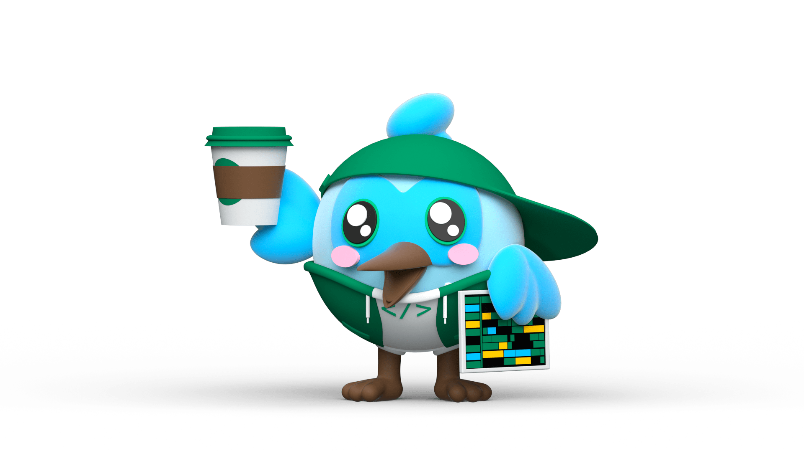

### Hi there 👋 I'm GHILANI Djihane

<!--
**Djihanegh/Djihanegh** is a ✨ _special_ ✨ repository because its `README.md` (this file) appears on your GitHub profile.

Here are some ideas to get you started:
- 📫 How to reach me: ...
- 😄 Pronouns: ...
- ⚡ Fun fact: ...
-->

  
- 🔭 I’m currently working on something cool
- 👯 I’m looking to collaborate on open source projects
- 💬 Ask me about Flutter 

  Connect with me:
  [][linkedin]
  
  [linkedin]: https://www.linkedin.com/in/djihane-ghilani-aa622b184/

